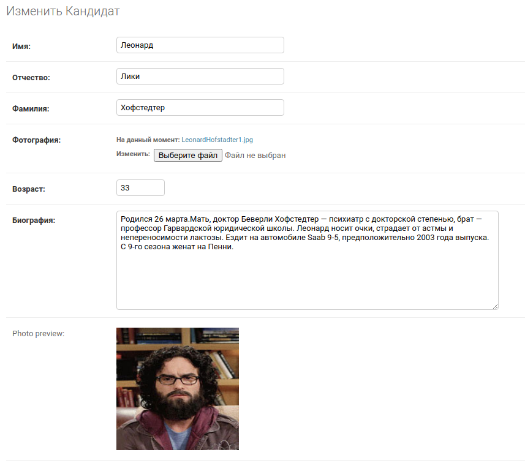

### Приложение для проведения голосования


## Настройка почты
Необходимо создать в корне файл .env с содержимым

```
EMAIL = 'ваш_логин@gmail.com'
EMAIL_PASSWORD="пароль"
```
или в settings присвоить новые значения

```
EMAIL_HOST_USER ='ваш_логин@gmail.com'
EMAIL_HOST_PASSWORD ="пароль"
```
### запуск контейнера с Redis
`
docker run -d -p 6379:6379 redis
`
#### Запуск воркера
`
celery -A votings_km worker -l info
`
#### Общее тех. описание
Время завершения голосования проверяется в check_time_middleware до того как метод __call__ вернет response.

xls отчеты хранятся в каталоге reports ( как вариант можно было 
tempfile,но имхо, если это необходимо)